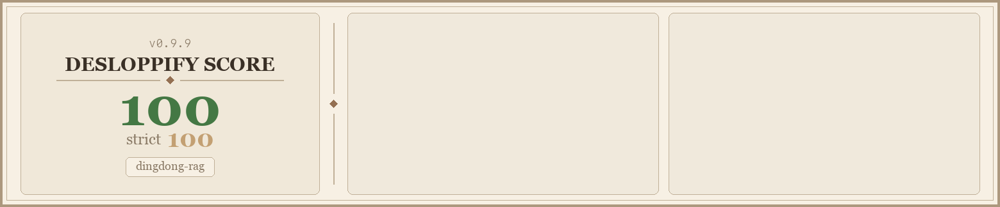
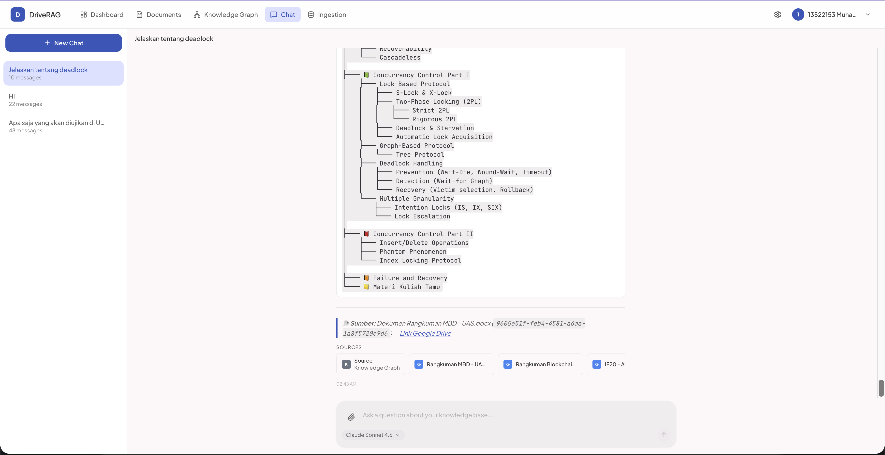
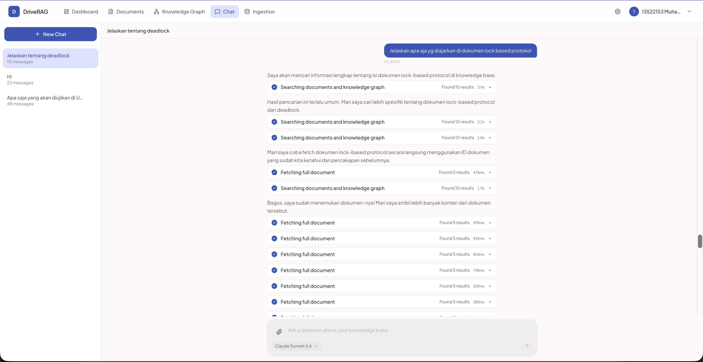
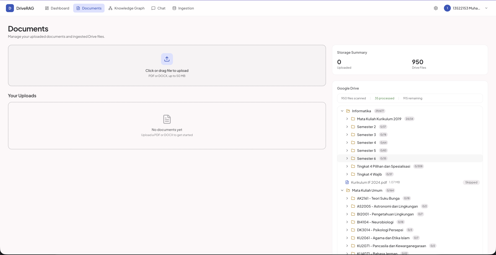
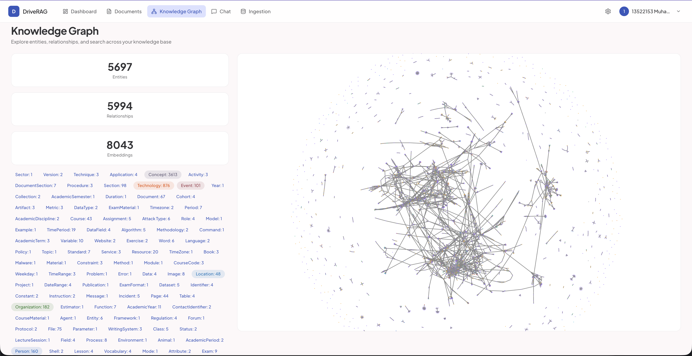
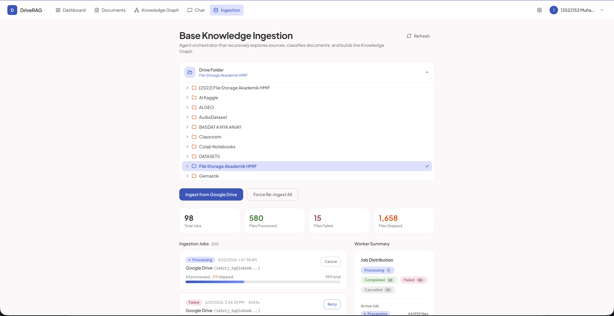

# DriveRAG

An agentic Knowledge Graph RAG application that ingests documents into a hybrid retrieval system (Neo4j graph + pgvector), with an autonomous AI agent that reasons over the knowledge to answer queries through a mobile-first web interface.



## Screenshots

**Chat**


**Agent Reasoning**


**Documents**


**Knowledge Graph**


**Base Knowledge Ingestion**


## Architecture

```
Frontend (Next.js 16)          Backend (FastAPI)              Infrastructure
┌──────────────────┐     ┌──────────────────────┐     ┌──────────────────┐
│  App Router      │────▶│  REST / WebSocket    │────▶│  PostgreSQL +    │
│  shadcn/ui       │     │  Domain modules:     │     │  pgvector        │
│  Tailwind CSS 4  │     │   auth, documents,   │     │  Neo4j 5         │
│  TypeScript 5    │     │   knowledge, agents, │     │  Redis 7         │
└──────────────────┘     │   ingestion          │     │  Supabase Storage│
                         │  Background worker   │     └──────────────────┘
                         └──────────────────────┘
```

**Two-tier knowledge:**
- **Base KG** -- Permanent knowledge ingested from Google Drive via agent swarm
- **User uploads** -- PDF/DOCX files with 7-day TTL, auto-extracted into graph + vectors

## Tech Stack

| Layer | Tech |
|-------|------|
| Frontend | Next.js 16, TypeScript 5 (strict), Tailwind CSS 4, shadcn/ui |
| Backend | FastAPI, Python 3.12+, SQLAlchemy 2.0 (async), Pydantic |
| Database | PostgreSQL 17 + pgvector, Neo4j 5, Redis 7 |
| AI | LangChain + LiteLLM, Claude Sonnet 4 (primary), GPT-4o (fallback) |
| Storage | Supabase Storage (uploads), Google Drive (base KG source) |
| Infra | Docker Compose, Vercel (frontend), VPS (backend) |

## Quick Start

### Prerequisites

- Docker + Docker Compose
- Node.js 18+ with `pnpm`
- Python 3.12+ with `uv`

### Setup

```bash
cp .env.example .env   # Edit with your API keys

# Full local stack (Postgres + Neo4j + Redis + backend + worker + frontend)
make dev

# Seed dev accounts (admin@dingdong.dev / admin123, user@dingdong.dev / user123)
make seed
```

The app will be available at:
- **Frontend:** http://localhost:3000
- **Backend API:** http://localhost:8000/api/v1
- **API Docs:** http://localhost:8000/api/v1/docs
- **Neo4j Browser:** http://localhost:17474

## Documentation

| Guide | Description |
|-------|-------------|
| [Development](docs/development.md) | Project structure, commands, API endpoints, environment variables |
| [Self-Hosting](docs/self-hosting.md) | Full setup guide for your own infrastructure |
| [Knowledge Seeding](docs/knowledge-seeding.md) | Google Drive ingestion, graph export/import, user uploads |
| [Deployment](docs/deployment.md) | Production deployment (backend VPS, frontend Vercel/Docker) |

## License

Private
